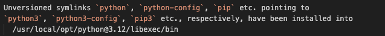

# Installing Python (optional for Mac users)

https://www.coursera.org/learn/django-web-framework/supplement/uQbqk/installing-python-optional-for-mac-users

An Apple Mac, by default, comes with Python version 2.7 installed. You can verify this by opening up a terminal and running the following command: 
```
1 python --version
```
To follow and complete the lessons in this course, you will need Python 3. 

Before you can install Python, you will need to install a few dependencies. These are Xcode and brew. You will find details of these in the Required Dependencies reading. The Mac has various ways to carry out software installations, the most common way is to use the package manager called brew to handle the installs. Make sure you have Homebrew installed on your local machine. 

Once the dependencies are installed, you can begin to install Python. Run the following command: 
```
1 brew install python
```
Phyton installation  with brew package manager on Mac devices

Phyton installation successful message

Mac automatically comes with version 2.7 by default. When you install Python via brew, it will install version 3.x. To verify that you have both versions installed, run the following:
```
1 python --version
2 python --version
```
```
1 python3 --version
```
If you experience any challenges with the versions above, you may also need to run the command using the root user such as:
```
1 sudo python -version
1 sudo python3 -version
```
The result displays:
Result of phyton installation with root user command

To reduce confusion, you need to set the paths to point to the brew install of python3.

First, let's figure out where the package manager brew installed it. Run the following command: 
```python
1 brew info python
```

``` 
1 brew info python3
```
# Below is the output of the above command:

Brew info phyton3 command output displaying information such as version, dependencies and caveats and folderpath
(base) MacBooks-MacBook-Air:Django-Coursera macbook$ brew info python
==> Downloading https://ghcr.io/v2/homebrew/portable-ruby/portable-ruby/blobs/sha256:02180ca8b8295422ae84921bcf034b7ee8ce5575488bd5e6a37a192e53cd5d34
############################################################################################################################################################ 100.0%
==> Pouring portable-ruby-3.1.4.el_capitan.bottle.tar.gz
==> Downloading https://formulae.brew.sh/api/formula.jws.json
############################################################################################################################################################ 100.0%
==> Downloading https://formulae.brew.sh/api/cask.jws.json
############################################################################################################################################################ 100.0%
==> Downloading https://formulae.brew.sh/api/cask_tap_migrations.jws.json
############################################################################################################################################################ 100.0%
==> Downloading https://formulae.brew.sh/api/formula_tap_migrations.jws.json
############################################################################################################################################################ 100.0%
Warning: Cask python was renamed to homebrew/core/python.
==> python@3.12: stable 3.12.2 (bottled)
Interpreted, interactive, object-oriented programming language
https://www.python.org/
Not installed
From: https://github.com/Homebrew/homebrew-core/blob/HEAD/Formula/p/python@3.12.rb
License: Python-2.0
==> Dependencies
Build: pkg-config ✘
Required: mpdecimal ✘, openssl@3 ✘, sqlite ✘, xz ✘
==> Caveats
Python has been installed as
  /usr/local/bin/python3

*Unversioned symlinks `python`, `python-config`, `pip` etc. pointing to `python3`, `python3-config`, `pip3` etc., respectively, have been installed into /usr/local/opt/python@3.12/libexec/bin*

See: https://docs.brew.sh/Homebrew-and-Python
==> Analytics
install: 259,187 (30 days), 598,904 (90 days), 941,124 (365 days)
install-on-request: 81,977 (30 days), 145,180 (90 days), 169,553 (365 days)
build-error: 1,863 (30 days)


# Running the following command will return the following output
```
brew info python3
```
*Output*

(base) MacBooks-MacBook-Air:Django-Coursera macbook$ brew info python3
Warning: Cask python3 was renamed to homebrew/core/python3.
==> python@3.12: stable 3.12.2 (bottled)
Interpreted, interactive, object-oriented programming language
https://www.python.org/
Not installed
From: https://github.com/Homebrew/homebrew-core/blob/HEAD/Formula/p/python@3.12.rb
License: Python-2.0
==> Dependencies
Build: pkg-config ✘
Required: mpdecimal ✘, openssl@3 ✘, sqlite ✘, xz ✘
==> Caveats
Python has been installed as
  /usr/local/bin/python3

Unversioned symlinks `python`, `python-config`, `pip` etc. pointing to
`python3`, `python3-config`, `pip3` etc., respectively, have been installed into
  /usr/local/opt/python@3.12/libexec/bin

See: https://docs.brew.sh/Homebrew-and-Python
==> Analytics
install: 259,229 (30 days), 598,997 (90 days), 941,304 (365 days)
install-on-request: 81,988 (30 days), 145,212 (90 days), 169,598 (365 days)
build-error: 1,863 (30 days)
(base) MacBooks-MacBook-Air:Django-Coursera macbook$ 

## The section you may be interested in is where it was installed. 

*Unversionedsymlinks `python`, `python-config`, `pip` etc. pointing to `python3`, `python3-config`, `pip3` etc., respectively, have been installed into /opt/homebrew/opt/python@3.10/libexec/bin* 


The /opt/homebrew/opt/python@3.x/libexec/bin is the one you want to use and set for our path. Copy it from the terminal. The following steps may vary depending on the Mac OS you are running. 
Zsh
1 vim ~/.zshrc
Bash 
1 vim ~/.bashrc

Vim is a text editor that allows you to change files directly from the shell. To make the edits: 

    Press the I key on your keyboard. 

    Add the following line and remember to replace 3.x with the python version that was installed on your system:

shell PATH="/opt/homebrew/opt/python@3.x/libexec/bin:${PATH}" OR

export PATH="/opt/homebrew/opt/python@3.x/libexec/bin:${PATH}

    Press the esc button to exit from insert mode. 

    Hold down the Shift Key and press the colon button represented by &;

    Type wq! and then press the Enter key to exit vim. 

    Run the following command:   
    Zshshell: source ~/.zshrc 
    Bashshell: source ~/.bashrc

    To verify everything is working as you would expect, run the following command: shell python --version Python 3.9.10

    You should see the output similar to the above, depending on your install version.

The list of commands relevant to vim can be found in the Course Introduction’s Additional Resources for this Lesson.

On completion of this reading, you will be able to identify any required dependencies for your operating system.

Setting up Python on Windows is straightforward and will install without any required dependencies. On Mac, however, you do need some additional dependencies prior to installing Python.
Xcode

To install brew, you need to install Xcode first. Homebrew does not come with its own compiler and it needs Xcode installed for it to work correctly. To install Xcode do the following:

    Open a terminal, and run the following command: 

1 shell xcode-select --install

    A pop-up box will appear asking you to confirm the installation. Click on the Install button. 

    Agree to the license agreement. 

brew

Mac's do not come with package managers like most Linux distributions. To make up for this an external tool called brew was created. To install brew, do the following:
1 /bin/bash -c "$(curl -fsSL https://raw.githubusercontent.com/Homebrew/install/HEAD/install.sh)" 

