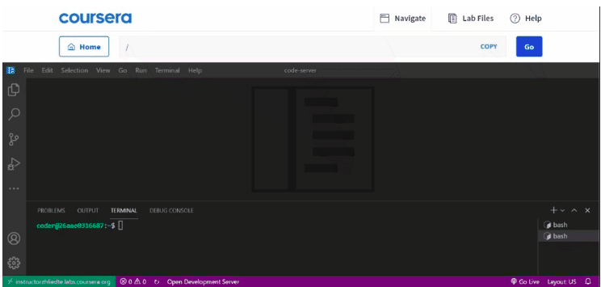

# Working with labs in this course

**NOTE:** This is a reference reading in support of the labs you will encounter throughout this course. It consists of helpful information you may require while working with different labs and you can use this as a point of reference  

The labs for this course have everything installed and set-up so you can start working with Django right away.  You can get started with terminal in VScode.

Open the Terminal




Verify that you are in ***/home/coder/project/workplace/myproject*** directory before running the command. Here is how you can navigate to it once the lab is up:

    For a directory named workplace, move inside the directory with the shell command such as:

**cd workplace**

 Move up the directory or outside the directory by one level, use a command such as:

**cd ..** 

In most cases for example, the learner will first step into the **workplace** directory and then again inside the **myproject** directory that contains the script for **manage.py** to run Django commands.  


To run and view your Django app in the browser, execute the following command in terminal. (Verify you are in the directory where manage.py file resides.)
```
1 python3 manage.py runserver #to run the server
2 python3 manage.py makemigrations #To compile the migrations
3 python3 manage.py migrate # To migrate the changes in the database
```
**Open the Browser**

**To view your code and instructions side-by-side, select the following in your VS Code toolbar:**

1. View -> Editor Layout -> Two Columns

2. To view a file in Preview mode, right click on the file and click on Browser Preview (in the EXPLORER sidebar) 

3. Select your code file in the code tree, which will open it up in a new VS Code tab.

4. You can drag any file over to the second column to view the contents in that column.

5. Great work! You can now see instructions and code at the same time.


Additional views to browse preview 

**General Notes**

    You may come across some code that is not directly relevant to the lab. A line such as:
```python
from django.shortcuts import render
```

Here for example, **render()**  is a helper function that is often required to render the template, hence Django imports it automatically. You may come across some similar auto-imports and it is safe to keep or remove them while updating the lab. 

+ This course recommends typing the code manually as you work through the exercises instead of copying and pasting. Typing the code will help you develop muscle memory and better your understanding of the fundamental concepts of this course.

+ The lab will use the Python commands that work on Linux shell. So to run any Python command, it is advisable to use python3 as the keyword for invoking ***Python 3+*** versions instead of just using the keyword ***python***

+ The commands added in the Labs/Readings/Videos are specific to the Operating System. For example, the use of Control instead of Command key in case of Windows OS and keyword ***python3*** instead of ***python*** in case of ***MacOS***. Learner should make the necessary adjustments in understanding  specific to the Operating System they use.  

+ While all the labs work on independent shell, on completion, it is a good practice to stop the server by pressing a Command on the shell such as: ***Ctrl/Cmd + C***