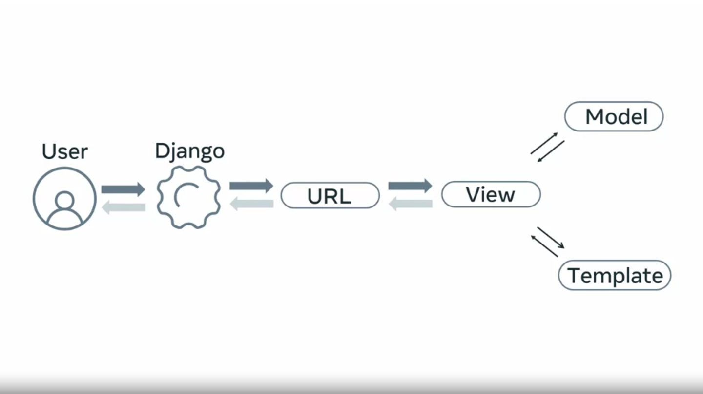
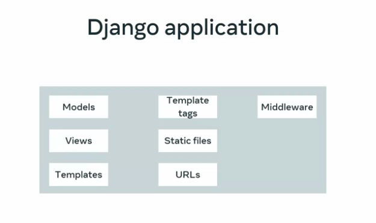

# Projects and apps overview
When learning web development it's important to understand what is required to build a website.
By now, you should be familiar with the basic structure of a website.It contains web pages consisting of HTML for the page structure, CSS for the look and style, and JavaScript for client-side interaction. Suppose you are creating a static website, the project structure may only need some CSS, JavaScript, and image folders.
This approach may work fine for a simple static website.
The purpose of the project structure is to lay out the files in a way that makes them easy to update.
However, when dealing with web applications requiring more complex functionality, such as the need to hold state or access and store data things need to be set up differently.

Using a framework, developers can focus on creating functionality unique to the projects, instead of repeating the repetitive coding tasks associated with building a web application.
Django was created by developers who have followed best practices.
It allows you to set up
your web application in
a structured way for easier development.
In this video, you will learn about
the core concepts of projects and apps in Django,
and how they provide a structure
for a developer to work from.
Before you explore the structure of the Django framework,
it's good to fully understand what is usually
required to create a dynamic web application.
This can involve working with Internet protocols,
web server configuration, and data retrieval, or storage.
Let's recap these concepts quickly.
Regarding Internet protocols,
recall that HTTP is used to get,
send, and render web content.
Understanding HTTP is essential in web development
as every action is always tied into a HTTP request,
pointing to some URL.
A web server is required to get
the page users want and return it to them via HTTP.
Django comes with its own development server,
which is written in Python.
This will save the developer a lot of
time and avoid any messy configurations.
Recall that the web is stateless,
meaning it does not store anything for future reference.
A database is required to keep and
retrieve the data associated with the website.
For example, every time a user submits a form on a site,
this data will need to be stored
so it can be retrieved and rendered later.
Now you have learned about how a framework
provides a structure for a developer to work from.
Let's explore the structure of a Django project.
In Django, a project
represents the entire web application.
Django provides a set of commands
that auto generates a project structure that
contains the configuration and setting
related to the entire web application.
You will learn more about this project structure later.
For now, just note that it's a way to
organize your Python files and folders.
This allows developers to focus on
code rather than configuration.
Now you know about projects.
Let's learn more about apps.
In Django, an app is a sub-module of a project.
It is typically used to implement
functionality for some specific purpose.
Apps can be self-contained,
meaning they do not rely on other apps to function.
As a result, they can be used or
reused in many different projects.
This leads nicely to the don't
repeat yourself, DRY principles.
Write once but use it many times.
As an aspiring developer in Django,
this might seem confusing when you encounter
the terms application and apps.
Just remember that a Django web application
is a project that contains many apps.
For example, suppose you are
creating a social media application.
Well, in Django,
the social media application would be the project,
and the different features would be
represented by the different apps.
You could create separate apps for the news feed,
the comments, the friends list,
the user page, and so on.
Apps are added using the start app command.
Like with the project, Django
also automatically generates
a self-contained directory and
its associated files inside the project structure.
For Django to recognize an app in a project,
it must be added to the installed apps setting.
Additionally, a Django app is a set of
code that interacts with various parts of the framework.
There are a few places where Django needs to
interact with installed applications.
This is mainly for configuration and introspection.
That's why the application registry maintains
metadata in an app config instance
for each installed application.
Applications usually include some combination,
such as models, views,
templates, template tags,
static files, URLs, and middleware.
Don't worry if you do not
understand all of these terms yet.
You'll learn about them all later in this course.
For now, just know that as a developer,
you will spend a great deal of time working with
apps as they contain all the project's different parts,
and as a developer deciding what constitutes an app,
and a project can be subjective,
and you may encounter various approaches to app design.
For now, it's best to think
that an app should be feature targeted,
and is best suited to one thing and one thing only.
Throughout this course, you will be working with
a project that contains only one app.
In this video, you learned about
the core concepts of projects and apps in
Django and how they provide
a structure for a developer to work from.
When learning web development, it's important to understand what is required to build a website. By now, you should be familiar with the basic structure of a website. It contains web pages consisting of HTML for the page structure, CSS for the look and style, and JavaScript for client-side interaction. Suppose you are creating a static website, the project structure may only need some CSS, JavaScript, and image folders. This approach may work fine for a simple static website. The purpose of the project structure is to lay out the files in a way that makes them easy to update. However, when dealing with web applications requiring more complex functionality, such as the need to hold state or access and store data, things need to be set up differently. Using a framework, developers can focus on creating functionality unique to the projects, instead of repeating the repetitive coding tasks associated with building a web application. Django was created by developers who have followed best practices. It allows you to set up your web application in a structured way for easier development. In this video, you will learn about the core concepts of projects and apps in Django, and how they provide a structure for a developer to work from. Before you explore the structure of the Django framework, it's good to fully understand what is usually required to create a dynamic web application. This can involve working with Internet protocols, web server configuration, and data retrieval, or storage. Let's recap these concepts quickly. Regarding Internet protocols, recall that HTTP is used to get, send, and render web content. Understanding HTTP is essential in web development as every action is always tied into a HTTP request, pointing to some URL. A web server is required to get the page users want and return it to them via HTTP. Django comes with its own development server, which is written in Python. This will save the developer a lot of time and avoid any messy configurations. Recall that the web is stateless, meaning it does not store anything for future reference. A database is required to keep and retrieve the data associated with the website. For example, every time a user submits a form on a site, this data will need to be stored so it can be retrieved and rendered later. Now you have learned about how a framework provides a structure for a developer to work from. Let's explore the structure of a Django project. In Django, a project represents the entire web application. Django provides a set of commands that auto generates a project structure that contains the configuration and setting related to the entire web application. You will learn more about this project structure later. For now, just note that it's a way to organize your Python files and folders. This allows developers to focus on code rather than configuration. Now you know about projects. Let's learn more about apps. In Django, an app is a sub-module of a project. It is typically used to implement functionality for some specific purpose. Apps can be self-contained, meaning they do not rely on other apps to function. As a result, they can be used or reused in many different projects. This leads nicely to the don't repeat yourself, DRY principles. Write once but use it many times. As an aspiring developer in Django, this might seem confusing when you encounter the terms application and apps. Just remember that a Django web application is a project that contains many apps. For example, suppose you are creating a social media application. Well, in Django, the social media application would be the project, and the different features would be represented by the different apps. You could create separate apps for the news feed, the comments, the friends list, the user page, and so on. Apps are added using the start app command. Like with the project, Django also automatically generates a self-contained directory and its associated files inside the project structure. For Django to recognize an app in a project, it must be added to the installed apps setting. Additionally, a Django app is a set of code that interacts with various parts of the framework. There are a few places where Django needs to interact with installed applications. This is mainly for configuration and introspection. That's why the application registry maintains metadata in an app config instance for each installed application. Applications usually include some combination, such as models, views, templates, template tags, static files, URLs, and middleware. Don't worry if you do not understand all of these terms yet. You'll learn about them all later in this course. For now, just know that as a developer, you will spend a great deal of time working with apps as they contain all the project's different parts, and as a developer deciding what constitutes an app, and a project can be subjective, and you may encounter various approaches to app design. For now, it's best to think that an app should be feature targeted, and is best suited to one thing and one thing only. Throughout this course, you will be working with a project that contains only one app. In this video, you learned about the core concepts of projects and apps in Django and how they provide a structure for a developer to work from. The purpose of the project structure is to lay out the files in a way that makes them easy to update. However, when dealing with web applications requiring more complex functionality, such as the need to hold state or access and store data, things need to be set up differently. Using a framework, developers can focus on: Added to Selection. Press [⌘ + S] to save as a note ​ : Added to Selection. Press [⌘ + S] to save as a note
