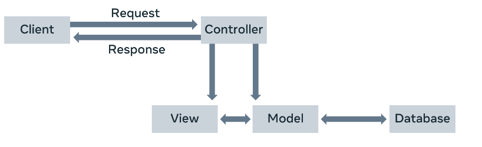
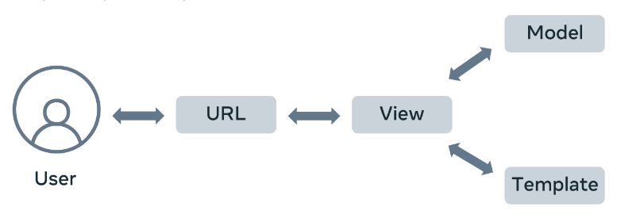

# MVT Overview

In this Reading, you will learn about Django's Model, View, and Template (MVT) application development pattern.

## Web Framework

A software framework, in general, is a standard, reusable software platform that facilitates the rapid development of software applications.

The web framework (also called web application framework) provides generic functionality needed for building web applications, APIs, and web services.

The main advantage of employing a web framework for development is that it provides "out of the box" support to perform everyday operations in the web development process.

For example, you can easily connect your application to databases. Usually, the framework handles tasks such as session management much more efficiently.

Likewise, it integrates with templating tools to render dynamic content on web pages.

## MVC Architecture

Most web frameworks implement the MVC (Model-View-Controller) architecture. 

The MVC design pattern separates the entire web application development process into three layers: Model, View, and Controller. 

The following diagram explains the interplay of these three layers.



In the MVC approach, the controller intercepts the user requests. 

It coordinates with the view and model layers to send the appropriate response back to the client.

The model is responsible for data definitions, processing logic, and interaction with the backend database.

The view is the presentation layer of the application.

It takes care of the placement and formatting of the result and sends it to the controller, which in turn, redirects it to the client as the application's response.

## MVT Architecture

The Django framework adapts a Model, View, and Template (MVT) approach, a slight variation of the MVC approach.

Here too, the model is the data layer of the application. The view is, in fact, the layer that undertakes the processing logic.

The template is the presentation layer.



A Django application consists of the following components: 

- URL dispatcher 
- View 
- Model 
- Template 

### URL dispatcher

Django's URL dispatcher mechanism is equivalent to the controller in the MVC architecture.

The urls.py module in the Django project's package folder acts as the dispatcher.

It defines the URL patterns. Each URL pattern is mapped with a view function to be invoked when the client's request URL is found to be matching with it.

The URL patterns defined in each app under the project are also included. Here’s the urls.py file in the app folder.

```python
from django.urls import path
from . import views

urlpatterns = [
    path('', views.index, name = 'index'),
]
```

When the server receives a request in the client URL, the dispatcher matches its pattern with the patterns available in the urls.py. 

It then routes the flow of the application toward its associated view.

## View
The view function reads the path, query, and body parameters included in the client's request If required, it uses this data to interact with the models to perform CRUD operations.

A view can be a user-defined function or a class.

You create View definitions in the views.pyfile of the respective app package folder. 

The following code in the view.py file defines the index() view function.

```python
 from django.shortcuts import render
 # your views here
 from django.http import HttpResponse

 def index(request):
    return HttpResponse('Hello, world!')
```

## Model
- A model is a Python class.
- An app may have one or more model classes, conventionally put in the models.py file.
- Django migrates the attributes of the model class to construct a database table of a matching structure.
- Django's Object Relational Mapper helps perform CRUD operations in an object-oriented way instead of invoking SQL queries.
- The view uses the client's and the model's data and renders its response using a template.

## Template
- A template is a web page containing a mix of static HTML and Django Template Language code blocks.
- You place Template web pages in the templates folder with the .html extension.
- Django's template processor uses any context data from the view inserted in these blocks to formulate a dynamic response.
- The view, in turn, returns the response to the user.

This explains how Django's MVT architecture handles the request-response cycle in a web application.


