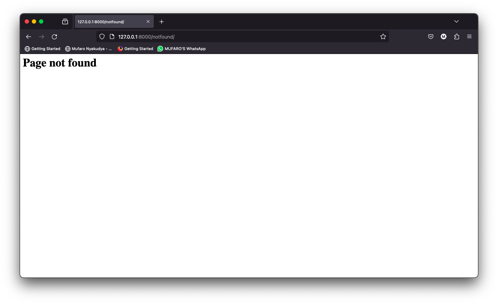

# Handling errors in views

In a Django application, a view function is where all the processing is done. 

It receives the request and formulates the response. 

In this Reading, you’ll learn how Django handles runtime errors or exceptions.

The response from the view is an object of HttpResponse. Its contents are also associated with a respective status code.

For example, status code 404 implies that the resource requested by the client cannot be found. Django has a generic HttpResponseNotFound class. You can return its object to convey the appropriate message.

```python
from django.http import HttpResponse, HttpResponseNotFound 
def my_view(request): 
    # ... 
    if condition==True: 
        return HttpResponseNotFound('<h1>Page not found</h1>') 
    else: 
        return HttpResponse('<h1>Page was found</h1>') 
```


You can also return an HttpResponse with the status code denoting the type of error.

```python
from django.http import HttpResponse 
def my_view(request): 
    # ... 
    if condition==True: 
        return HttpResponse('<h1>Page not found</h1>', status='404') 
    else: 
        return HttpResponse('<h1>Page was found</h1>') 
```

The main difference in using HttpResponseNotFound as opposed to HttpResponse that must be understood is that Django internally sends an error code 404. The appropriate page for 404 can then be configured and rendered, else the browser displays its default 404 view. 

A common cause of the 404 status code is the user entering an incorrect URL. 

Django makes it easy to work with this error code. 

Put a string argument inside the HttpResponseNotFound() to view the error message. Instead, raise Http404. Django displays a standard error page with the status.

(Instead, raise Http404 exception).

Consider the following scenario, where you have a Product model in the app. 

The user wants the details of a product with a specific Product ID. 

In the following view function, id is the parameter obtained from the URL. 

It tries to determine whether any product with the given id is available. If not, the Http404 exception is raised.

```python
from django.http import Http404, HttpResponse 
from .models import Product 

def detail(request, id): 
    try: 
        p = Product.objects.get(pk=id) 
    except Product.DoesNotExist: 
        raise Http404("Product does not exist") 
    return HttpResponse("Product Found") 
```

Just like the HttpResponseNotFound, there are a number of other predefined classes such as HttpResponseBadRequest, HttpResponseForbidden and so on.

### Custom error pages
If you want to show your own error page whenever the user encounters a 404 error, you must create a 404.html page and put it in the project/templates folder. 

You will learn more about how to do this later when you explore templates.

### Displaying error messages in the browser
Usually, the Django development server is in DEBUG mode, which shows the error's traceback instead of the exception.

#### Standard 404 error page display on browser
To render the custom exception message, the DEBUG variable in the project’s settings should be set to False.

```python
#settings.py  

# SECURITY WARNING: don't run with debug turned on in production!  
  
DEBUG=FALSE 
```

#### Page displaying the info that requested resource was not found on the server

### Exception classes
Django’s exception classes are defined in the django.core.exceptions module. 

Some important exception types are:

- ObjectDoesNotExist: All the exceptions of the DoesNotExist are inherited from this base exception.

- EmptyResultSet: This exception is raised if a query does not return any result.

- FieldDoesNotExist: This exception is raised when the requested field does not exist.

```python
try: 
    field = model._meta.get_field(field_name) 
except FieldDoesNotExist: 
    return HttpResponse("Field Does not exist") 
```

- MultipleObjectsReturned: When you expect a certain query to return only a single object, however multiple objects are returned. This is when you need to raise this exception.

- PermissionDenied: This exception is raised when a user does not have permission to perform the action requested.

```python
def myview(request): 
    if not request.user.has_perm('myapp.view_mymodel'): 
        raise PermissionDenied() 
    return HttpResponse() 
```

- ViewDoesNotExist: This exception is raised by django.urls when a requested view does not exist, possibly because of incorrect mapping defined in the URLconf. 

When a certain view is called with a POST or PUT request, the request body is populated by the form data. 

Django’s Form API defines various fields specific to the type of data stored. For example, you have EmailField, FileField, IntegerField, MultipleChoiceField. 

These fields have built-in validators. The is_valid() method returns True if the validations are passed. You can raise an exception if it returns False.

```python
def myview(request):   
    if request.method == "POST":   
        form = MyForm(request.POST)   
        if form.is_valid():   
            #process the form data 
        else:   
                return HttpResponse("Form submitted with invalid data") 
```

In addition to the exceptions defined in the core module, you can process the standard Python exceptions and the database-related exceptions.
