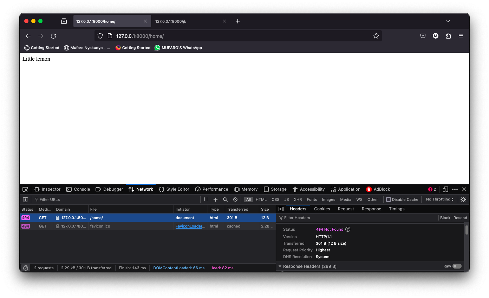

```markdown
# Handling Errors and Creating Custom 404 Page in Django

When navigating the web, it's common to occasionally enter a URL or click a link only to find that the page you are looking for cannot be found. In this video, you will learn how to handle errors and views using Django and explore how to create a custom 404 error page using the `HttpResponseNotFound` class.

## Default Error Handling in Django

Recall that Django displays a default "Page Not Found" error page when a URL cannot be matched. However, this default error page contains technical information that is not suitable for end-users.

## Creating a Custom 404 Error Page

To create a custom view for the error page, follow these steps:

1. Set `DEBUG=False` in the Django settings file to display a standard 404 page.
2. Create a new file `views.py` at the project level.
3. Update the `urls.py` file with the necessary imports and URL patterns.
4. Add another URL pattern for the custom error page.
5. Define a custom view function, e.g., `handler404`, in `views.py`.
6. Return an `HttpResponse` object with a custom message in the view function.

## Example Code

Here's an example of how to create a custom 404 error page in Django:

1. Update `settings.py`:

```python
DEBUG = False
ALLOWED_HOSTS = ['*']
```

2. Create `views.py`:

```python
from django.http import HttpResponse

def handler404(request, exception):
    return HttpResponse("404 - Page not Found")
```

3. Update `urls.py`:

```python
from django.urls import path
from django.conf.urls import handler404
from myproject.views import handler404

urlpatterns = [
    # Other URL patterns
]

handler404 = 'myproject.views.handler404'
```

## Conclusion

Creating a custom error page in Django allows you to provide a user-friendly experience for visitors encountering a "Page Not Found" error. By following the steps outlined above, you can customize the error message and ensure consistency with your website's branding.
