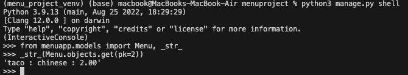

## Project Setup
In the video tutorial, the process of creating a model in a Django project is explained step by step. Let's break down each step and concept:

1. **Project Setup**: The project named "menu project" and the app named "menuapp" have already been created.

2. **Models.py File**: The `Models.py` file inside the "menuapp" app is where the model definition is written.

3. **Creating a Model**: To create a model, a Python class named `Menu` is defined inside the `Models.py` file. This class inherits from `models.Model`.

4. **Attributes of the Model**:
   - Three attributes are defined for the `Menu` model: `name`, `cuisine`, and `price`.
   - Each attribute corresponds to a field in the database table.
   - `models.CharField` is used for string fields (`name` and `cuisine`), with a specified `max_length` parameter.
   - `models.IntegerField` is used for the `price` field to store integer values.

5. **Accessing the Model in Django Shell**:
   - The Django shell (`python manage.py shell`) is used to interact with the Django project.
   - Before accessing the `Menu` model, it needs to be imported from `models.py`.

6. **Import Error**:
   - Initially, an import error occurs because the model hasn't been registered in the `settings.py` file under the `INSTALLED_APPS` list.

7. **Adding Model to INSTALLED_APPS**:
   - The `Menu` model is added to the `INSTALLED_APPS` list in the `settings.py` file.

8. **Migrations**:
   - Migrations are Django's way of propagating changes you make to your models (adding a field, deleting a model, etc.) into your database schema.
   - After modifying the models, you need to generate migrations (`python manage.py makemigrations`) and then apply them (`python manage.py migrate`).

9. **Using the Model**:
   - After successful migration, the `Menu` model can be accessed in the Django shell without errors.
   - Methods such as `objects.all()` and `objects.create()` are demonstrated to interact with the database using the model.
   - Custom methods can be defined within the model class to customize behavior, such as how the model instances are displayed.

   **Ilustration Example**

   This example demonstrates how to use the Django shell to interact with the Menu model. First, they import the Menu model from menuapp.models. Then, they retrieve all entries from the Menu model using the ```objects.all()``` method. After that, they create a new entry in the Menu model using the ```objects.create()``` method, specifying the values for the ```name```, ```cuisine```, and ```price``` fields. ```name='Pasta', cuisine='Italian', price=10``` Finally, they retrieve all entries from the Menu model again to verify that the new entry was created successfully.
   example 2 ```name = 'taco', cuisine = 'Mexican', price = 2```

10. **Updating Entries**:
    - Entries in the database can be updated using the `get()` method to retrieve a specific object and then modifying its attributes.
```python
# retrieving the record where the pk=2
s = Menu.objects.get(pk=2)
# updating that record
s.cuisine = 'chinese'
s.save()
```


11. **Django Admin Panel**:
    - Django provides an admin interface that can be used to view and manage database entries without writing custom views.
    - However, understanding how to interact with models directly is important for more complex operations and customization.

In summary, the video tutorial covers the basics of creating a model in Django, including defining attributes, performing database operations, and understanding migrations. It also highlights the importance of understanding the underlying concepts for effective development.