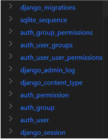
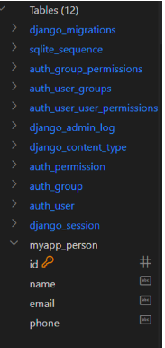

How to use migrations
======================

Django translates the models into respective database tables in the backend database with a mechanism known as migration. It also propagates any changes in the model structure such as adding, modifying or removing a field attribute of a model class to the mapped table.

Django’s migration system has the following commands:

- `makemigrations`
- `migrate`
- `sqlmigrate`
- `showmigrations`

Django’s migration is a version control system. Whenever you add a new model or effect changes in an existing model, you need to run the `makemigrations` command. It creates a script for making changes in the mapped table. Every time you run the `makemigrations` command and Django detects the changes, a script with its name and version number is created. To implement the changes according to the migration script, you need to run the `migrate` command.


Migrating Models of INSTALLED APPS
-----------------------------------

When you create a Django project with the `startproject` command, certain apps are installed by default. These apps are listed in the `INSTALLED_APPS` section in the project’s `settings.py` file.

```python
INSTALLED_APPS = [ 
    'django.contrib.admin', 
    'django.contrib.auth', 
    'django.contrib.contenttypes', 
    'django.contrib.sessions', 
    'django.contrib.messages', 
    'django.contrib.staticfiles', 
]
```

Data needs to be stored via these apps for their functionality to work. For example, the auth package controls the users, groups, and permissions, so there must be corresponding tables created in the database. Django uses the SQLite database by default. For that purpose, you run the `migrate` command.

```bash
python manage.py migrate 
```

Then, the tables required by the `INSTALLED_APPS` are created.



Let’s create an app inside our Django project.
===============================================

```bash
(django) C:\django\myproject> python manage.py startapp myapp 
```

This creates a `myapp` package folder inside the outer `myproject` folder. Inside `myapp`, a `migrations` package is also created, which is empty to begin with.


Using the `makemigrations` command
----------------------------------

Open the `models.py` file and add a `Person` model to it.

```python
from django.db import models 

class Person(models.Model): 
    name = models.CharField(max_length=20) 
    email = models.EmailField() 
    phone = models.CharField(max_length=20) 
```

The first step towards creating the `Person` table in the database is to run the `makemigrations` command.

```bash
(django) C:\django\myproject>python manage.py makemigrations 
```

Migrations for 'myapp': 
  `myapp\migrations\0001_initial.py` 
    - Create model `Person`

Notice that in the migrations package, a migration script `0001_initial.py`, is created. It indicates what the script intends to do, which is: Create model `Person`.

If you open the migration file, you’ll find a migration class in it.

```python
from django.db import migrations, models  

class Migration(migrations.Migration): 

    initial = True 

    dependencies = [ 
    ] 

    operations = [ 
    ]
```

As mentioned above, you need to run the `migrate` command to apply the tasks in the migrations file to be performed.

```bash
(django) C:\django\myproject>python manage.py migrate        
```

Operations to perform: 
  Apply all migrations: admin, auth, contenttypes, myapp, sessions 
Running migrations: 
  Applying `myapp.0001_initial`... OK 

Have a look at the tables in your database `db.sqlite3`. The `person` table with three fields can be seen in it.




Version control
===============

Now, let's modify the `Person` model class by changing the `name` field to `Person_name` and running `makemigrations` again.

```bash
(django) C:\django\myproject>python manage.py makemigrations 
```

Was `person.name` renamed to `person.person_name` (a CharField)? [y/N] y 

Migrations for 'myapp': 
  `myapp\migrations\0002_rename_name_person_person_name.py` 
    - Rename field `name` on `person` to `person_name`

A second migration script is created in the migrations folder. Before finalizing the change, add a new field – `age` – in the `Person` model and run `makemigrations` again.

```bash
(django) C:\django\myproject>python manage.py makemigrations 
```

Migrations for 'myapp': 
  `myapp\migrations\0003_person_age.py` 
    - Add field `age` to `person`

Showmigrations command
----------------------

Now there are two unmigrated changes in the model. Run the `showmigrations` command:

```bash
(django) C:\django\myproject>python manage.py showmigrations 
```

. . . 
. . . 
`myapp` 
[X] `0001_initial` 
[ ] `0002_rename_name_person_person_name` 
[ ] `0003_person_age` 
. . . 

The initial migration (file numbered `0001`) has already migrated. The X mark is indicative of this. However, the next two migrations don’t show the X mark, which means they are pending. If we run the `migrate` command, both modifications will be reflected in the table structure.

```bash
(django) C:\django\myproject>python manage.py migrate        
```

Operations to perform: 
  Apply all migrations: admin, auth, contenttypes, myapp, sessions 
Running migrations: 
  Applying `myapp.0002_rename_name_person_person_name`... OK 
  Applying `myapp.0003_person_age`... OK 

As mentioned earlier, Django’s migration mechanism provides efficient version control. You may want to fall back upon the table structure before adding the `age` field. Run the `migrate` command and specify which migration file to be used so that the migrations after it will be undone or unapplied.

```bash
(django) C:\django\myproject>python manage.py migrate myapp 0002_rename_name_person_person_name   
```

Operations to perform: 
  Target specific migration: `0002_rename_name_person_person_name`, from `myapp` 
Running migrations: 
  Rendering model states... DONE 
  Unapplying `myapp.0003_person_age`... OK 

`sqlmigrate` Command
---------------------

Lastly, the `sqlmigrate` command shows the SQL query or queries executed when a certain migration script is run. For example, the first migration over the `myapp`’s `person` model is intended to create the `person` table. The `sqlmigrate` command for this script shows the `CREATE TABLE` statement for this purpose.

```bash
(django) C:\django\myproject>python manage.py sqlmigrate myapp 0001_initial  
```

BEGIN; 
-- 
-- Create model `Person` 
-- 
CREATE TABLE "myapp_person" ("id" integer NOT NULL PRIMARY KEY AUTOINCREMENT, "name" varchar(20) NOT NULL, "email" varchar(254) NOT NULL, "phone" varchar(20) NOT NULL); 
COMMIT; 

In this reading, you learned about when to use migrations, best practices and that the migration system in Django manages data creation and modification very effectively and efficiently.
