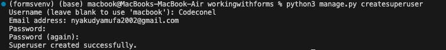
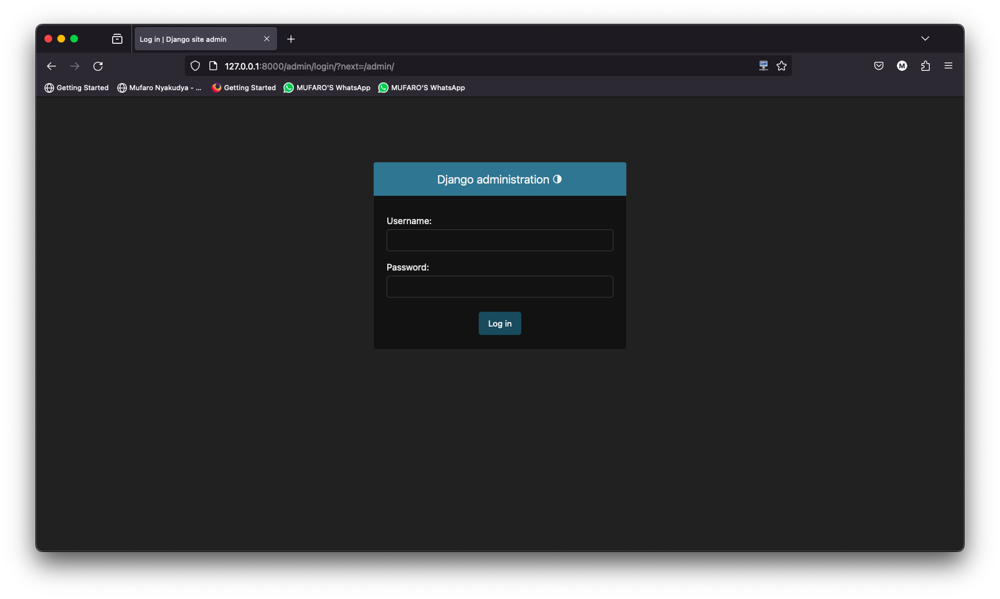
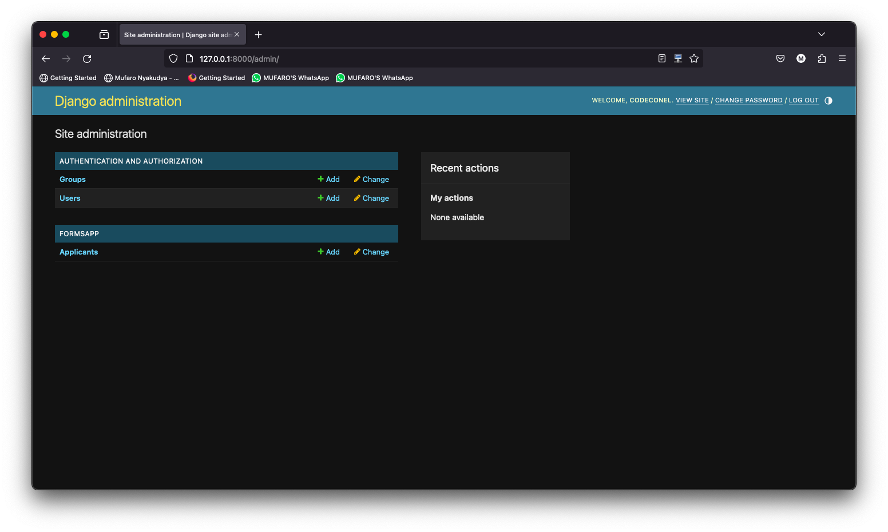

### Activating Django's Admin Interface

- **Purpose of Admin Interface**:
    - Allows certain users to administer and manage application data.
    - Provides a unified interface for adding, editing, and deleting content.
    - Automates the process by directly linking to models in the project.
    - Helps with tasks like creating and managing users, controlling access permissions, and forming user groups.
    - Intended for site managers rather than site visitors.

- **Django Admin Interface**:
    - Automatically created and linked to models in the project.
    - Default utility provided by Django for administrative tasks.
    - Enabled and assigned to a project by default.
    - Located in the installed apps section of the `settings.py` file.

### Creating Admin User and Overview of Django Admin Interface

- **Creating Admin User**:
    - Run `python3 manage.py createsuperuser`.
    - Provide username, email, and password.
    - Follow prompts to create a superuser.

- **Accessing Admin Interface**:
    - Open the default URL in the browser.
    - Append `/admin` to the URL.
    - Log in using the created superuser credentials.

- **Overview**:
    - Basic interface with options to manage groups and users.
    - Sample models listed, such as reservations.
    - Ability to add, change, or delete configurations.
    - Options to modify user details, assign permissions, and view user history.

### Utility of Django Admin Interface

- **Time-saving Tool**:
    - Provides an easy-to-modify interface for managing project and model data.
    - Saves time for developers by automating administrative tasks.

### Conclusion

- **Learning Outcome**:
    - Acquired knowledge on starting Django's admin interface.
    - Learned to add users, groups, models, and assign permissions using the admin interface.
    - Preparation for further exploration of advanced features in Django administration.