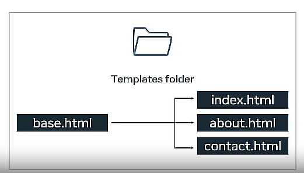

**Using Templates in Django:**

1. **Introduction:**
   - Templates facilitate dynamic content generation in Django web frameworks.
   - They utilize the Django template language (DTL) for markup.
  
2. **Syntax for Dynamic Content:**
   - Templates contain static HTML alongside dynamic content marked by double curly braces.
   - Example: `<h1>{{ dish_name }}</h1>` inserts dynamic variables like `dish_name` into HTML.

3. **Render Function and Context:**
   - `render()` function replaces variables with values from a dictionary passed as a parameter.
   - Syntax: `render(request, path, dictionary)`.

4. **Separation of Logic:**
   - Templates separate user interface logic from application logic.
   - Dynamic content in templates is written in DTL syntax.

5. **Constructs in DTL:**
   - DTL includes variables, tags, filters, and comments for embedding dynamic content.
   - Enables loops, conditions, and logic within templates.

6. **Template Loading and Rendering:**
   - Django provides an API for loading and rendering templates.
   - Configuration settings in `settings.py` define template engine settings.

7. **Template Inheritance:**
   - Facilitates code reuse through inheritance.
   - Base templates contain common HTML elements, with child templates overriding specific blocks.

   

8. **Best Practices:**
   - Place template files inside a `templates` folder for organization.
   - Follow DRY (Don't Repeat Yourself) principle by reusing templates.

**Conclusion:**
   - Templates are crucial for generating dynamic content in Django.
   - Understanding DTL syntax and template inheritance enhances code efficiency and organization.