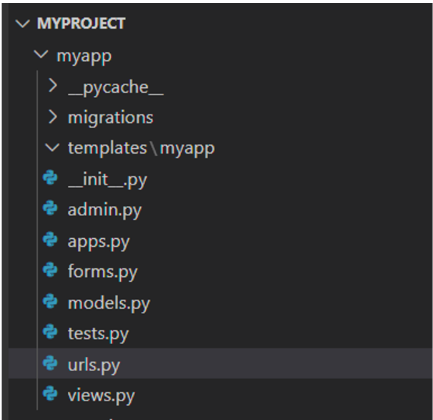

# Template Examples

In this reading, you will be introduced to simple template code examples covering variables and filters. More in-depth explanations and examples are provided in a later lesson.

## HTML Response

Django’s view function returns a `HttpResponse` whose content-type header is "text/html" by default. So, if it enters a string, it is rendered as HTML on the browser. The string itself may have certain HTML tags embedded in it. Accordingly, the browser interprets the tags and renders them.

Look at the following view function. It returns a string with "Hello World" tucked between `<h1>` and `</h1>` tags.

```python
from django.http import HttpResponse
def index(request):
    return HttpResponse("<h1>Hello, world,</h1>")
```

Let’s say that the app is properly configured and that it is included in the INSTALLED_APPS, and the function is mapped to the `appname/` URL in the `urls.py` file, you’ll get the Hello World message in the H1 tag.


## Urls.py file under myapp

You can write the entire web page script in a string and use it as an argument to the HttpResponse. But what if there is some variable information in between the static HTML?

For example, let's reference the code block above.

What happens if you want to say Hello to a person whose name appears in the URL as a parameter? You can use Python’s string substitution and pass it as a response.

```python
from django.http import HttpResponse
def index(request):
    return HttpResponse("<h1>Hello, {} </h1>".format(name))
```

Generating HTML from Python code takes time and can be complicated. It needs frequent escaping, especially if there are many variables.

Introducing certain conditional logic will be more difficult. That's when you use the templates.

A template is an HTML file with placeholders for variable data marked by a special syntax. Django uses its own template language called Django Template Language (DTL). Just like HTML, the DTL has its own tags that control how the variable part is filled.

To replace the Hello World, create a `hello.html` file and place it in the templates folder in the Django project’s BASE_DIR.

```html
<html>
    <head>
        <title>My django website</title>
    </head>
    <body>
        <h1>Hello World</h1>
    </body>
</html>
```

## Rendering a Template

In the view function, import the loader class from the `django.template` module and obtain the template object from `hello.html`. You can now render it as the HttpResponse.

```python
from django.http import HttpResponse
from django.template import loader
def index(request):
    template = loader.get_template('hello.html')
    context = {}
    return HttpResponse(template.render(context, request))

```

If it seems slightly complicated, Django provides a shortcut method called `render()`. It eliminates the HttpResponse and loader classes.

```python
from django.http import render
return render(request, 'home.html', {}) dd
```

## Variable Tag

In the above code, the `render()` function’s third parameter is an empty dictionary object. It is called the template context. You should pass the path parameter as a context to `hello.html`.

```python
from django.shortcuts import render
def index(request, name):
    context = {'name':name}
    return render(request, 'hello.html', context)
```

Modify the `hello.html` file by replacing World with the Django variable syntax. Put the key of the context dictionary `name` inside double curly brackets as in `{{ name }}`.

```html
<html>
    <body>
        <h1>Hello {{ name }}</h1>
    </body>
</html>
```

You can use `` tag of DTL to implement conditional logic inside the template. Similarly, with `` and `` tags, a looping construct can be built in the template, which may be useful to display records from a database table on the web page. Django’s Template Language has many more tags. You’ll explore this in a subsequent lesson.

## Filters

Another important part of Django Template Language is the filters. While tags may be considered similar to keywords in a programming language, filters merely represent the temporarily modified value of a template variable. The filter is applied to a variable by the `|` (known as Pipe) symbol, such as:

```plaintext
{{ variable_name | filter_name }}
```

Here are some filters in action. The `index()` view in the above examples receives a name parameter, and it is rendered in the template with the `{{ name }}` expression tag. If you apply the upper filter to it, the name will be rendered in uppercase.

```plaintext
{{ name | upper }}
```

As a result, if the path parameter passed to the view is John, it will be rendered as JOHN.

Likewise, the lower filter converts the string to its lowercase, the title filter renders a string so that the first letter of each word in a multi-word string appears in uppercase. Therefore, the string “simple is better than complex” becomes “Simple Is Better Than Complex”.

The length filter works with a list and returns the number of items in it. The view passes a list as a context to the template: `nums=[1,2,3,4]`

The template filter `{{ nums | length }}` outputs 4.

The wordcount filter is similar. It tells you how many words are present in the template variable that has to be a string. For example:

String = 'Simple is better than complex' 

is passed as a context,

```plaintext
{{ string | wordcount }} returns 5.
```

The slice filter resembles Python’s slice operator, which separates a part of the given list object. So, if:

`nums = [1,2,3,4,5,6,7,8]`

Is passed in the context,

```plaintext
{{ nums | slice:"1:3" }}
```

It returns [2,3] and then you can iterate over it.

The first and last filters return the first and last item in the list.
